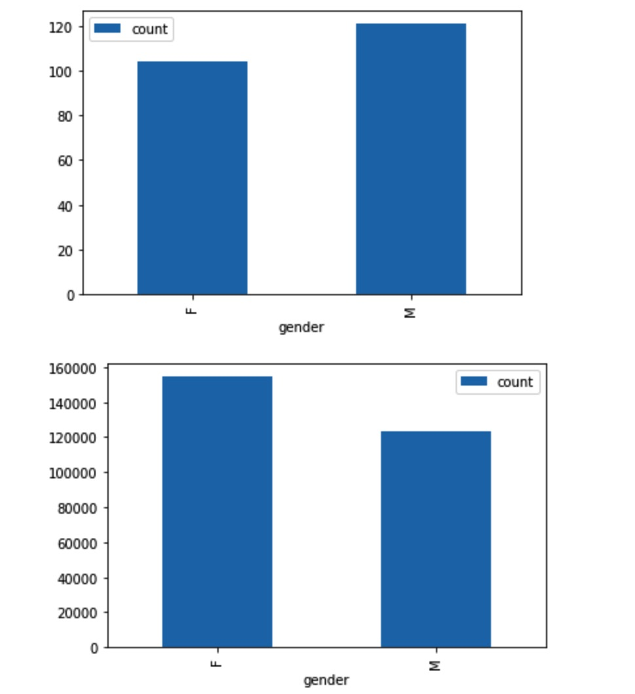
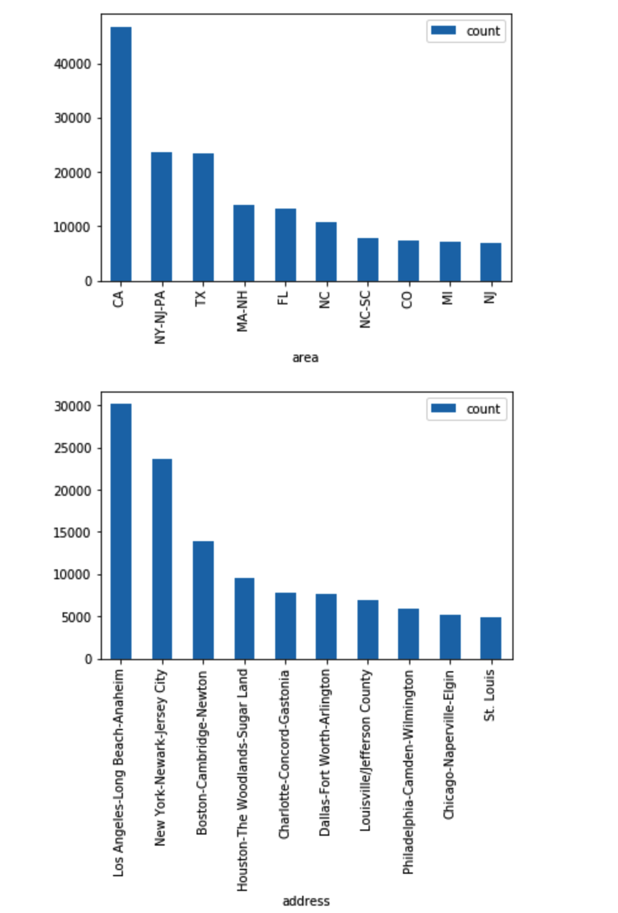
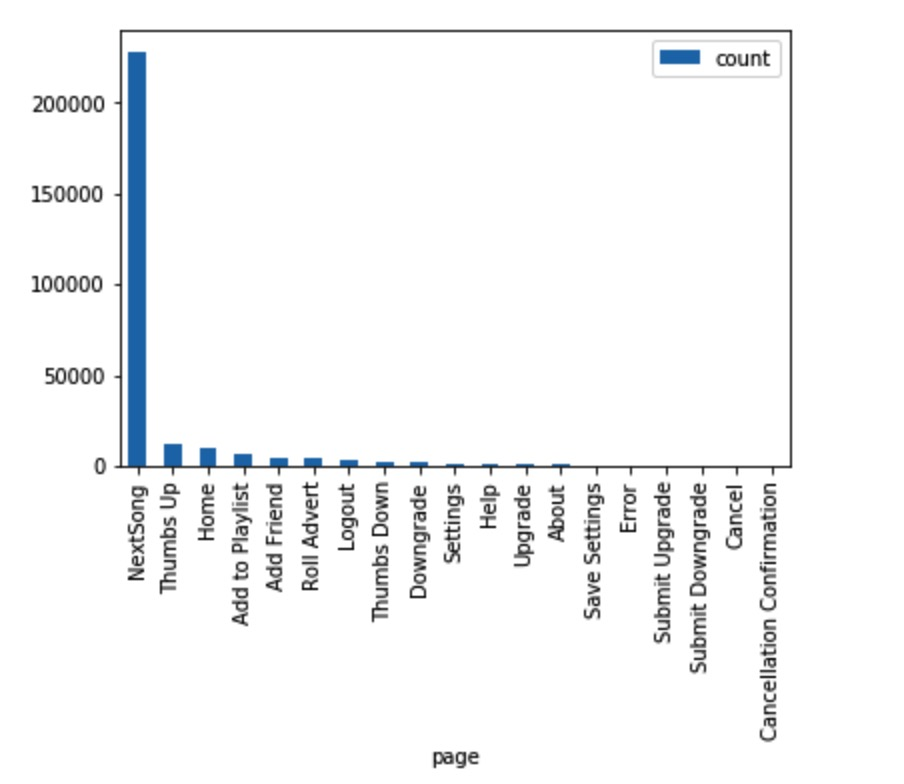
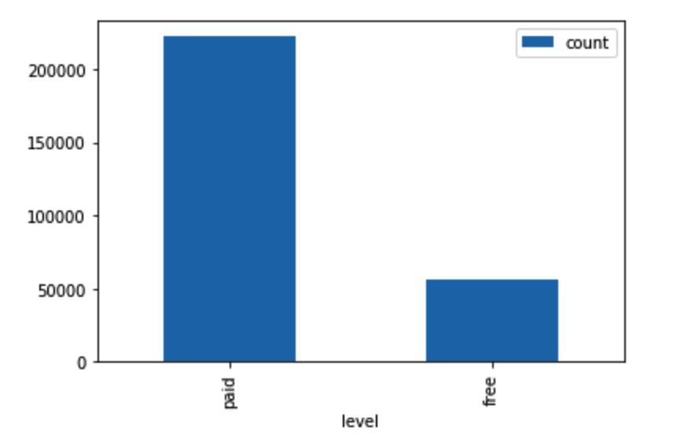
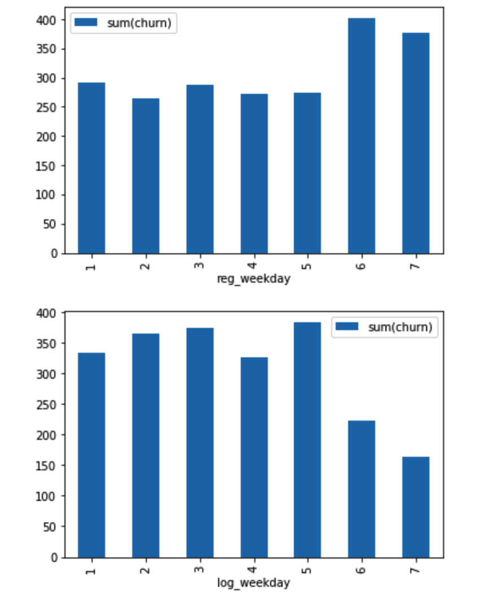
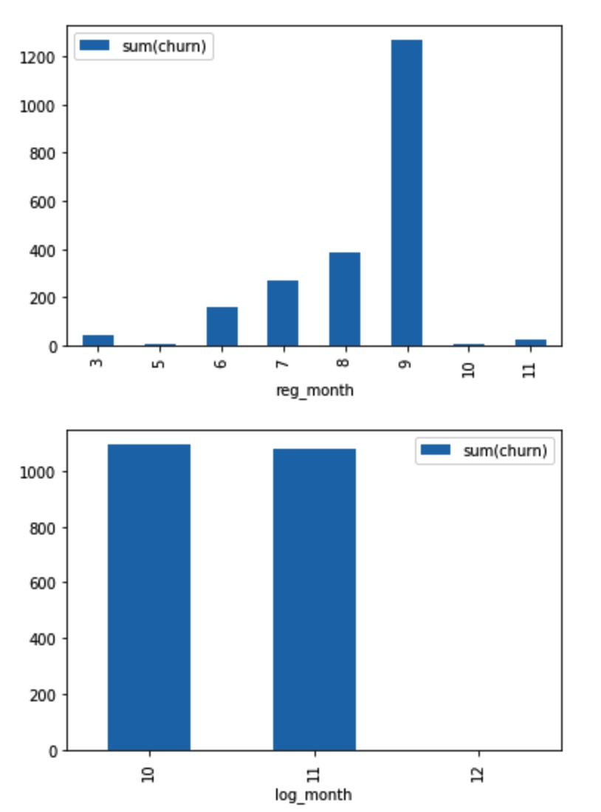
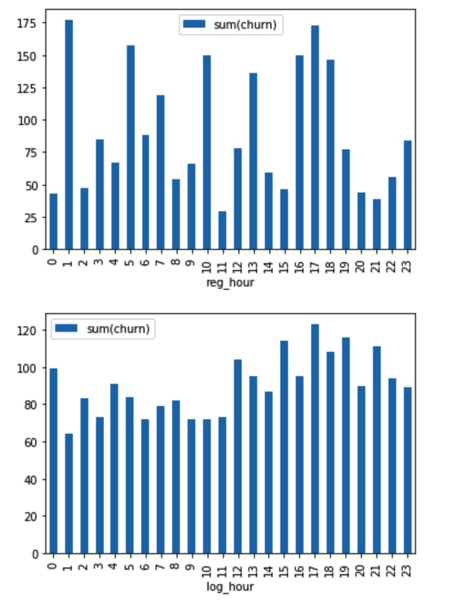
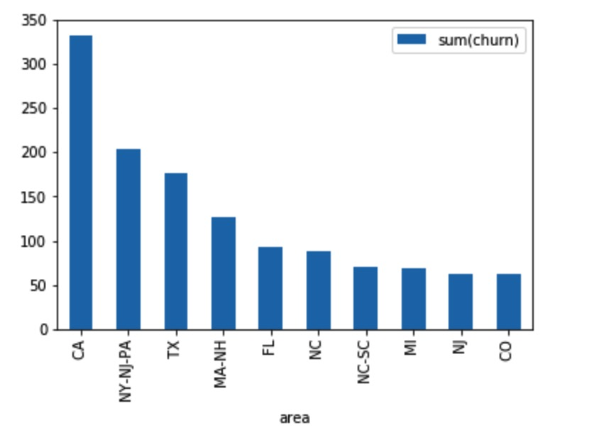
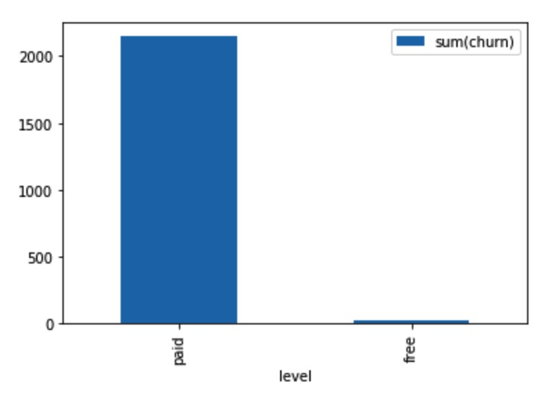
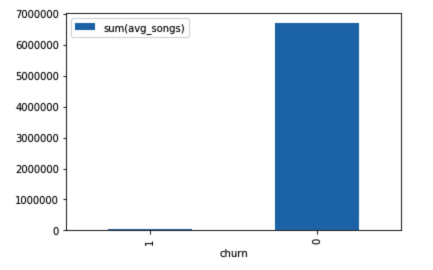

# Sparkify Machine Learning Project

# Definitions

Sparkify is a brand-new music streaming startup seeking  continuous growth. It has an ever-growing user base and has collected a huge amount of data about user activities. Sparkify has offered a  paid service for the users to access more songs of high quality. From the user activities they find that sometimes users like to downgrade their level or directly confirm cancellation. The team wants to analyze this huge amount of data to predict whether a user will downgrade from premium to free tier or cancel service directly, so they can adjust their service and offering more discounts and incentives potentially saving the business.

The data is in JSON format, it represents user activities. Whenever a user listens to a song, logout, like a song or hearing an ad, there will be a new record generated.

## Problem Description

Given the user activies data, we must construct a classification prediction model to judge if a user will downgrade or cancel service. It is a typical machine-learning problem, and because of the huge amount (about 12GB), we choose to use Spark, a brilliant distributive computing framework.

We read the JSON data into spark, do some data wrangling and perform the EDA tasks to deeply understanding the data, demonstrate the findings using data visualization. Then we construct several classification models and evaluate them, choosing the best as our final solution.

## Evaluation Metrics

We use ROC curve as the evalutaion metrics of classifier's performance. ROC curve is a graphical plot that summarises how a classification system  performs and allows us to compare the performace of different classifers. We compute the area under curve (AUC) from ROC plots, the bigger the AUC the better.

# Analysis

## EDA

The original data has the following schema:

```
root
 |-- artist: string (nullable = true)
 |-- auth: string (nullable = true)
 |-- firstName: string (nullable = true)
 |-- gender: string (nullable = true)
 |-- itemInSession: long (nullable = true)
 |-- lastName: string (nullable = true)
 |-- length: double (nullable = true)
 |-- level: string (nullable = true)
 |-- location: string (nullable = true)
 |-- method: string (nullable = true)
 |-- page: string (nullable = true)
 |-- registration: long (nullable = true)
 |-- sessionId: long (nullable = true)
 |-- song: string (nullable = true)
 |-- status: long (nullable = true)
 |-- ts: long (nullable = true)
 |-- userAgent: string (nullable = true)
 |-- userId: string (nullable = true)
```

There are 8346 records with no user ID, I simply delete them, because these users are likely guests, they haven't register our app and haven't enjoyed any service, they are useless to our model, so we can ignore them. And a descriptive statistics about the length feature shows that there is no abnormals in it:

```
+-------+-----------------+
|summary|           length|
+-------+-----------------+
|  count|           228108|
|   mean|249.1171819778458|
| stddev|99.23517921058361|
|    min|          0.78322|
|    max|       3024.66567|
+-------+-----------------+
```

The location feature represents the users location, such as "Boston-Cambridge-Newton, MA-NH", we need to extract the area such as "MA-NH" from it, because metroplitan area such as MA-NH may be an important feature. So I creates two more features: address and area, like this:

```
+-----------------------+------+
|address                |area  |
+-----------------------+------+
|Bakersfield            | CA   |
|Boston-Cambridge-Newton| MA-NH|
|Bakersfield            | CA   |
|Boston-Cambridge-Newton| MA-NH|
|Bakersfield            | CA   |
+-----------------------+------+
```

Features `ts` and `registration` represents time info in timestamp format. Feature `ts` represents log date, it ranges from 2018-10-01 00:01:57 to 2018-12-03 01:11:16 with no abnormals; feature `registration` represents registration  date, it ranges from 2018-03-18 13:44:35 to 2018-11-26 15:49:14 with no abnormals. These features may contain important information about when user registers or do actions in our app. I create another two features `registration_date` and `log_date`, then I extract date and time information from it: month, day, weekday, hour and whether is a weekend or not. After doing all these processing I finally got:

```
root
 |-- artist: string (nullable = true)
 |-- auth: string (nullable = true)
 |-- firstName: string (nullable = true)
 |-- gender: string (nullable = true)
 |-- itemInSession: long (nullable = true)
 |-- lastName: string (nullable = true)
 |-- length: double (nullable = true)
 |-- level: string (nullable = true)
 |-- location: string (nullable = true)
 |-- method: string (nullable = true)
 |-- page: string (nullable = true)
 |-- registration: long (nullable = true)
 |-- sessionId: long (nullable = true)
 |-- song: string (nullable = true)
 |-- status: long (nullable = true)
 |-- ts: long (nullable = true)
 |-- userAgent: string (nullable = true)
 |-- userId: string (nullable = true)
 |-- registration_date: timestamp (nullable = true)
 |-- log_date: timestamp (nullable = true)
 |-- address: string (nullable = true)
 |-- area: string (nullable = true)
 |-- reg_month: integer (nullable = true)
 |-- reg_day: integer (nullable = true)
 |-- reg_weekday: integer (nullable = true)
 |-- reg_hour: integer (nullable = true)
 |-- reg_weekend: integer (nullable = true)
 |-- log_month: integer (nullable = true)
 |-- log_day: integer (nullable = true)
 |-- log_weekday: integer (nullable = true)
 |-- log_hour: integer (nullable = true)
 |-- log_weekend: integer (nullable = true)
```

## Visualization

构建了数据可视化来更好地展示你在数据探索性分析时的发现。保证可视化方案适用于你要绘制的数据图表

### 1. Visualization about gender



There are more male audience than females, but females generates more records.

### 2. Visualization about area and address



California state, Los Angeles-Long Beach-Anaheim and New York-Newark-Jersey City outweighs a lot as hot spots.

### 3. Visualization about page



Page events statistics, `Submit Downgrade`, `Downgrade` and `Cancellation Confirmation` should be put focus on. I create a label `churn` using these three page events.

```python
related_events = ['Downgrade', 'Submit Downgrade', 'Cancellation Confirmation']
mark_churn_events = F.udf(lambda page: 1 if page in related_events else 0, IntegerType())
df_cleaned = df_cleaned.withColumn('churn', mark_churn_events('page'))
```

### 4. Visualization about level



Paid and free users statistics, paid users outweighs free users.

### 5. Relationship between churn and weekday



Users registered in weekend tend to do more churns, but users tend to do less churns at weekend.

### 6. Relationship about churn and month



Users registered in September more likely to churn, but users tends to do no churn in December.

### 7. Relationship about churn and hour



There's no obvious relation between registration hour and churn, but users tend to churn from 12 p.m to 0 a.m.

### 8. Relationship about area and churn



Some areas are more likely to churn such as CA.

### 9. Relationship about level and churn



Of course paid users are likely to churn than free users.

### 10. Relationship about average number of songs between home visit and churn

Inspired  by the course, I create a feature indicating the average number of songs a user listened between two home visits. And analyze it with the `churn` feature:

 

Users who churned tend to listen much less songs than others.

# Modeling

## Preprocessing

## Model Training

## Model Improvements

# Results

## Validation

## What Do We Get

# Conclusion

## Rethinking

## How To Do Better

